# Gamebox

Hardware platform and game library based on Arduino and LED display 64x64

This project uses Adafruit-like display:
https://learn.adafruit.com/32x16-32x32-rgb-led-matrix

The display is logically split into two parts with separate controllers.
Lower part of display is connected through the upper one with
the cable as follows:
```
LLLLUUUU
LLLLUUUU
```
Therefore this is logically 128x32 display.
Arduino shifts 128 pixels into display registers at every iteration.

Demonstration of the working prototype: https://www.youtube.com/watch?v=gy7oADJboqM

## Arduino Uno wiring

Display-Arduino
* R1 - 2
* G1 - 3
* B1 - 4
* R2 - 5
* G2 - 6
* B2 - 7
* A - A0
* B - A1
* C - A2
* D - A3
* LAT - 10
* CLK - 8
* OE - 9

Buttons are connected via 74165, NES joystick is connected to (CLOCK, LATCHJ, SER)
* CLOCK - 11
* LATCHB - 12
* LATCHJ - 13
* DATA - A4

## Arduino Mega wiring

Display-Arduino
* R1 - 53
* G1 - 52
* B1 - 51
* R2 - 22
* G2 - 23
* B2 - 24
* A - A0
* B - A1
* C - A2
* D - A3
* LAT - 5
* CLK - 2
* OE - 3

Buttons are connected via 74165, NES joystick is connected to (CLOCK, LATCHJ, SER)
* CLOCK - A8
* LATCHB - A9
* LATCHJ - A10
* DATA - A11

## Sound chip connection

Configuration with Arduino Mega supports chiptune music for YM-2149.

YM-Arduino:
* BC2 - +5V
* BDIR - A7
* BC1 - A6
* DATA(8 pins) - PORTC(8 pins)

YM has its own clock generator.

## Tutorial
See game/Template.cpp

## Existing games

### BreakOut

Pong-like game.

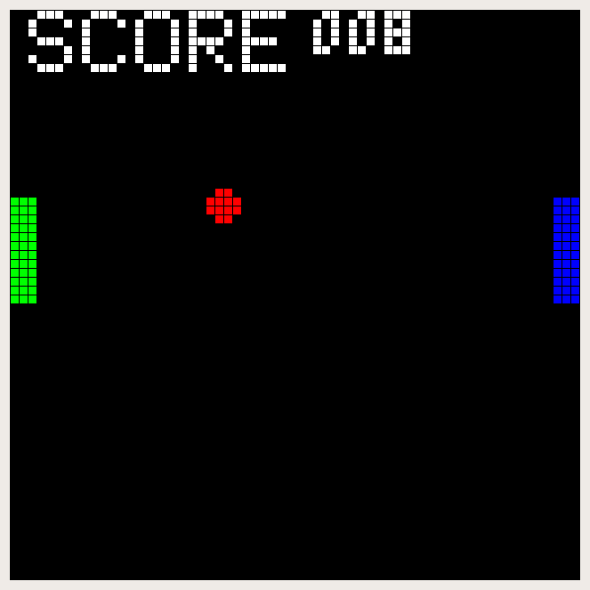

### Flappy

Flappy submarine - use any key to push it up.

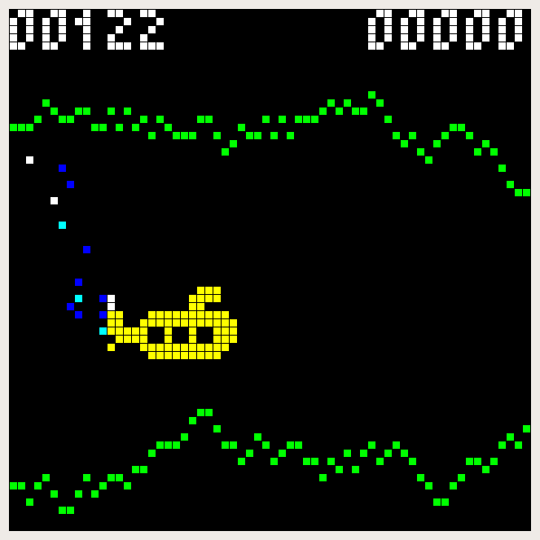

### Ghostbuster

You can't beat the boss here.

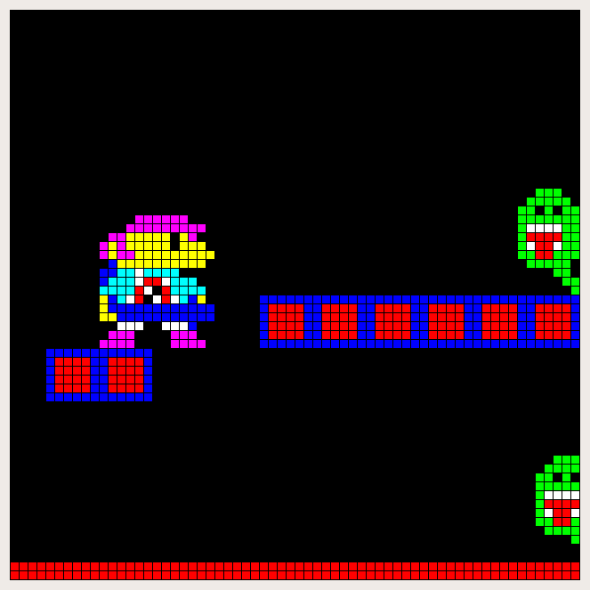

### Invaders

Space invaders-like game.

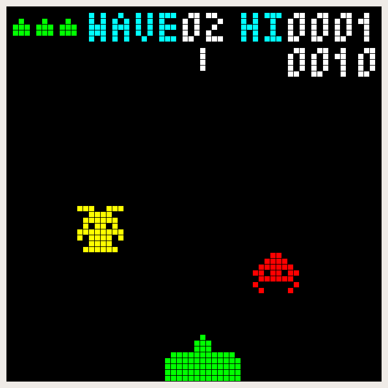

### LodeRunner

Lode runner in a small labyrinth.

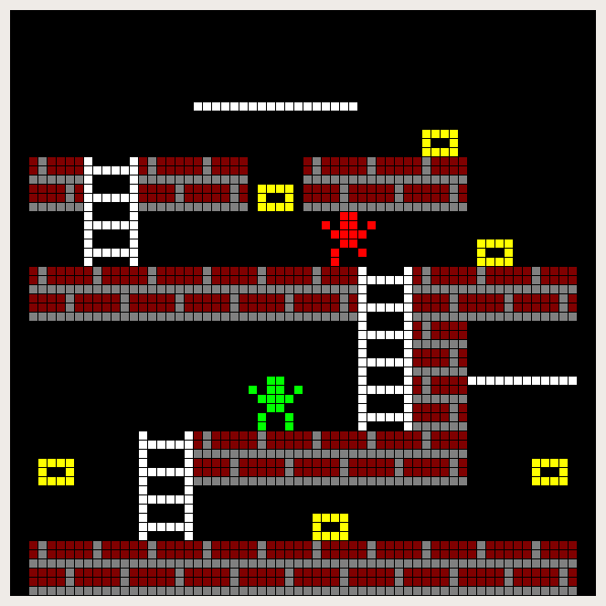

### Mario

Mario collecting the coins and trying not to fall into the hole.

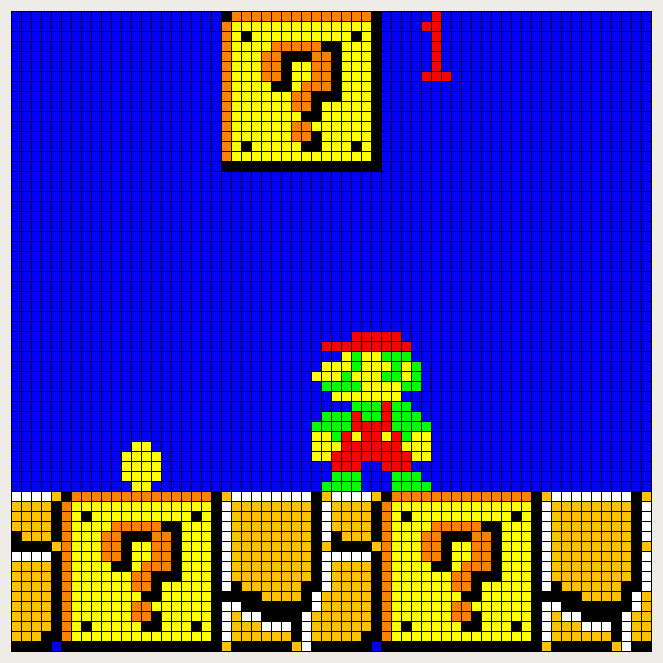

### Saper

Minesweeper game.

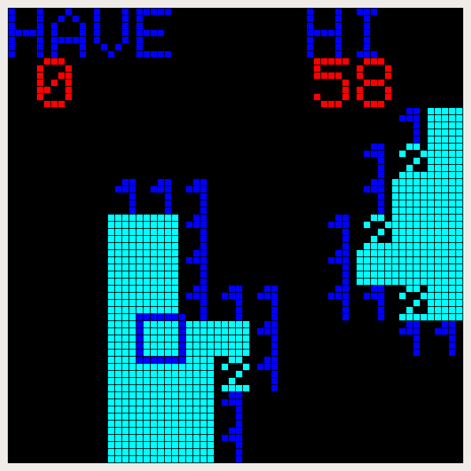

### Snail

Sokoban-like game.

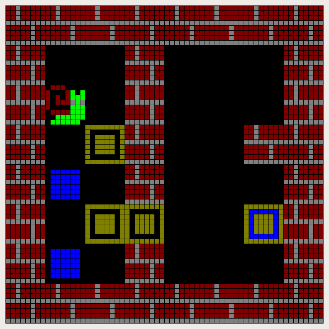

### Snake

Simplest snake. Try to grow it bigger than 128 and overflow the buffer.

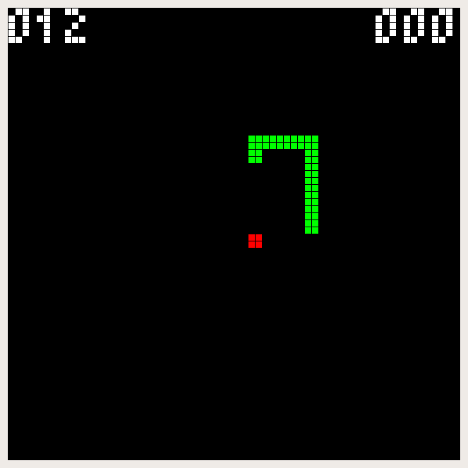

### Snake2

Snake with the obstacles.
Demonstrates using of the frame buffer for storing the game map.

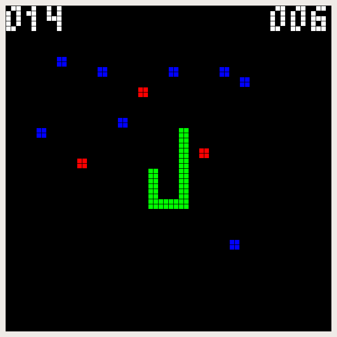

### SpaceShips

Spaceship and asteroids. No shooting.

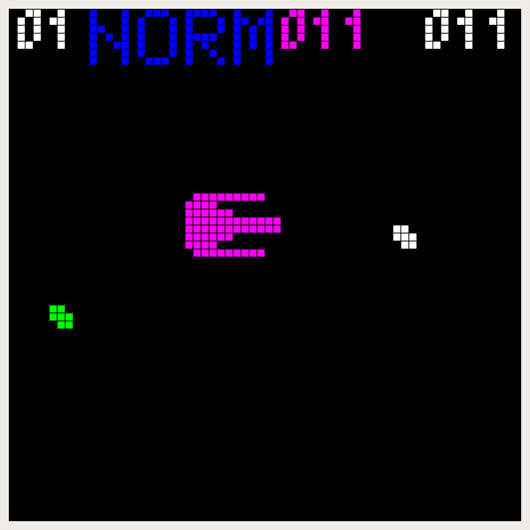

### TicTacToe

Almost working tic-tac-toe game.

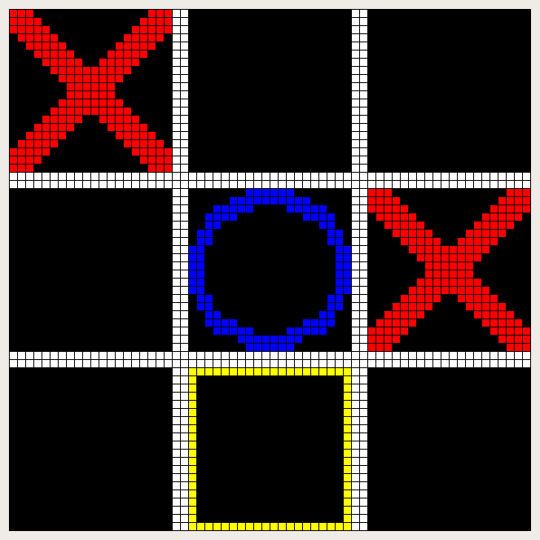

## Future games

* 2048
* Tetris
* rogue-like
* Doom-like
* True breakout-like game
* Anything else from Atari 2600
